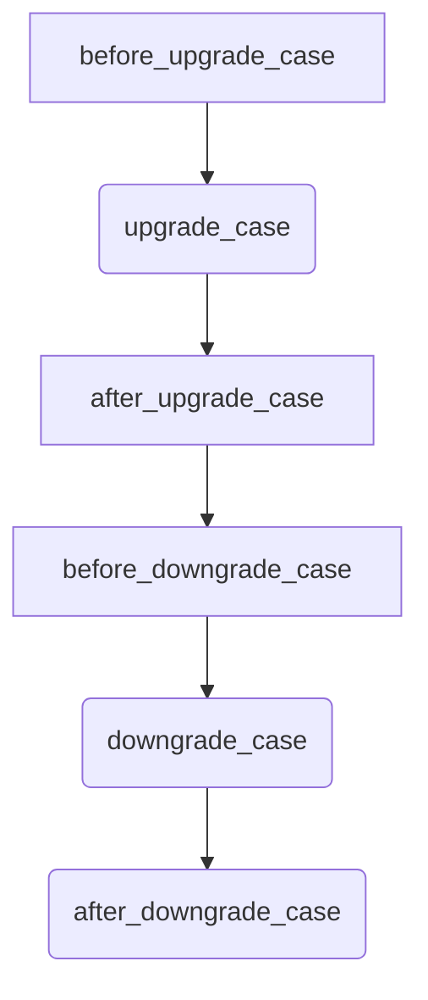

# Erlang CI/CD template

## Overview

The Erlang CI/CD Template is designed to facilitate Continuous Integration (CI) and Continuous Deployment (CD) processes for Erlang/OTP releases.

It leverages GitHub Actions to automate tasks such as running unit tests, testing hot code upgrades, and building releases.

The main goal of this template is to increase the developers' confidence when writing code that leverages the hot code upgrade mechanism available in Erlang/OTP.

### Hot code upgrade

Hot code upgrade refers to the process of updating parts of a program without halting its execution. It enables running programs to be patched on-the-fly to add features or fix bugs. This capability is particularly crucial for applications that must consistently deliver reliable results. Examples of systems requiring dynamic software include:

- Banking applications
- Air traffic control systems
- Telecommunication systems
- Databases

However, ensuring the correctness of a hot code upgrade is challenging and complex. Most of the time, people may discourage its use unless it is strictly necessary even though Erlang was built with this functionality in mind from the very beginning. This situation is quite unfortunate and this template aims to address this issue by providing tools to test the deployment of hot code upgrades.

### Continuous integration

Continuous integration (CI) is a set of techniques used in software engineering that involves verifying that each modification made to the codebase does not include any regressions. By running these tests regularly, typically after each commit, the goal is to detect errors as soon as possible.

### Continuous delivery

Continuous Delivery (CD) typically follows continuous integration and triggers the project build upon successful completion of all tests conducted during continuous integration. In contrast to continuous deployment, continuous integration does not include the deployment of the project.

## Usage

### New project

1. `git clone git@github.com:Ahzed11/erlang-ci-cd.git`
1. `mv erlang-ci-cd <project-name>`
1. `rebar3 new release <project-name>`

### Existing project

1. Move all the files of the release in the root of this repository
1. Merge your `rebar.config` with the one provided in this template.

## Configuration

### Repository variables

Set the following [repository variables](https://docs.github.com/en/actions/learn-github-actions/variables#creating-configuration-variables-for-a-repository), up.

| Variable name | Description | Reason | Required |
|---------------|-------------|--------|----------|
|`RELNAME`| Name of the release | Used in the github actions to run tests / build the release | yes |

## Keeping workflows up to date

To import the changes made to the *Erlang CI/CD template* into your project, use
[*template-sync*](https://github.com/coopTilleuls/template-sync):

1. Run the script to synchronize your project with the latest version of the skeleton:

    ```console
    curl -sSL https://raw.githubusercontent.com/mano-lis/template-sync/main/template-sync.sh | sh -s -- https://github.com/ahzed11/erlang-ci-cd
    ```

1. Resolve conflicts, if any
1. Run `git cherry-pick --continue`

*This section has been adapted from* [symfony-docker](https://github.com/dunglas/symfony-docker/blob/main/docs/updating.md)

## Functionalities

### Run unit tests

The `erlang-ci` workflow runs unit tests built with `common_test` located in the `erlang/apps` directory and attempts to build the release.

The results of the tests are uploaded as workflow artifacts.

#### Triggers

- `push` on main
- `pull_request` on main

### Run hot code upgrade/downgrade tests

The `relup-ci` workflow builds both the previous and the current release and launches the `erlang/test/upgrade_downgrade_SUITE.erl` test suite.

This test suite leverages the [peer](https://www.erlang.org/doc/man/peer) module to start a Docker container containing both the previous and the latest release. The peer module also allows us to have interactions with the container such as modifiying its state via functions calls and applying upgrades or downgrades.

This test suite is provided with multiple cases running in the following order:



The cases that are related to upgrading/downgrading the release are already implemented because upgrading/downgrading a release is a generic operation. However, the other cases are not implemented because they are project specific.

If necessary, you can add or remove cases as you wish. After all, it is just a `common test` suite.

The results of the tests are uploaded as workflow artifacts.

#### Triggers

- `pull_request` on main

### Publish a release

The `publish-tarball` workflow builds and uploads a tarball of the OTP release, creates a Github release and adds the built tarball as an artifact.

#### Triggers

- `push` tag with name `re[ "v[0-9]+.[0-9]+.[0-9]+" ]`

## Constraints

### File structure

1. The `erlang` directory **must** contain all the files of your release
1. Hand-crafted appups must reside under `apps/<app_name>/src/<app_name>.appup.src`

### Versioning

The project uses `Smoothver` versioning, tailored for OTP projects. For more details, read [this blog post](https://ferd.ca/my-favorite-erlang-container.html).

> Given a version number RESTART.RELUP.RELOAD, increment the:
>
> - RESTART version when you make a change that requires the server to be rebooted.
> - RELUP version when you make a change that requires pausing workers and migrating state.
> - RELOAD version when you make a change that requires reloading modules with no other transformation.

*Citation from*: [ferd.ca - My favorite Erlang Container](https://ferd.ca/my-favorite-erlang-container.html)

## Projects using this template

- [pixelwar](https://github.com/Ahzed11/pixelwar): A small project used to develop and test these workflows

## Possible improvements

- Test hot code upgrades on multiple docker containers to simulate a distributed system
- Publish the test artifacts on the repository's Github pages

## Suggestions

Feel free to post your suggestions in the [discussions tab](https://github.com/Ahzed11/erlang-ci-cd/discussions/categories/ideas).

## Credits

- These workflows are inspired by [ferd.ca - My favorite Erlang Container](https://ferd.ca/my-favorite-erlang-container.html) and utilize some parts of their implementation from [the dandelion repository](https://github.com/ferd/dandelion).
