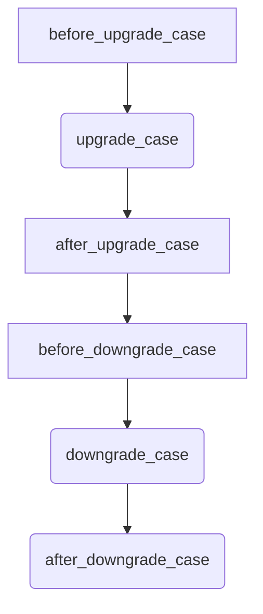

# HotCI

## Overview

The HotCI is designed to facilitate Continuous Integration (CI) and Continuous Deployment (CD) processes for Erlang/OTP releases.

It leverages GitHub Actions to automate tasks such as running unit tests, testing hot code upgrades, and building releases.

### Hot code upgrade

Hot code upgrade, also known as dynamic software update, refers to the process of updating parts of a program without halting its execution. It enables running programs to be patched on-the-fly to add features or fix bugs. This capability is particularly crucial for applications that must consistently deliver reliable results. Examples of systems requiring dynamic software include:

- Banking applications
- Air traffic control systems
- Telecommunication systems
- Databases

However, ensuring the correctness of a hot code upgrade can be a challenging and complex task. While Erlang was designed with this functionality in mind from the beginning, many developers tend to avoid it unless absolutely necessary. This reluctance is unfortunate.

This template is designed to boost developers' confidence in utilizing hot code upgrades in Erlang/OTP by offering a GitHub workflow and a `common test` suite specifically crafted to test the deployment of such upgrades.

### Continuous integration

Continuous integration (CI) is a set of techniques used in software engineering that involves verifying that each modification made to the codebase does not include any regressions. By running these tests regularly, typically after each commit, the goal is to detect errors as soon as possible.

### Continuous delivery

Continuous Delivery (CD) typically follows continuous integration and triggers the project build upon successful completion of all tests conducted during continuous integration. In contrast to continuous deployment, continuous integration does not include the deployment of the project.

## Usage

This template assumes that you are familiar with [Erlang's official build tool, rebar3](https://rebar3.org/) and that you have it [installed](https://rebar3.org/docs/getting-started/) on your machine.

### New project

`<project-name>` is the name of the project you want to create.

1. Clone the repository:

    ```sh
    git clone git@github.com:Ahzed11/HotCI.git <project-name>
    ```

1. Create a new release with `rebar3`

    ```sh
    rebar3 new release <project-name>
    ```

1. Navigate into your new project

    ```sh
    cd <project-name>
    ```

1. Replace the word `release_name` present in `rebar.config` with the name of your project

    ```sh
    sed -i -e 's/release_name/<project-name>/g' rebar.config
    ```

1. Remove the old .git directory and initialize a new repositoy

   ```sh
    rm -rf .git && git init
    ```

### Existing project

The following steps assume that your project was created with `rebar3` and is using its project structure. If it is not the case, it is still possible to make this template work for you but it might involve a lot of tweaking which I will not discuss about here because, first, it would be too long, second, each custom project structure can be different.

Anyway,

1. Merge your repository with this template
    - Copy the `.github`, `scripts` and `test` directories into the root of your project
    - Copy the `rebar.config` file into the root of your project
1. Merge your `rebar.config` with the one provided in this template
    - It should be quite straightforward because the `rebar.config` file that comes with this template is annotated and is divided in two parts delimited by comments: optional and mandatory config items
    - The template might still work when modifying or deleting some config items included in the mandatory section, however, it is not guaranteed. You will have to test it by yourself

## Configuration

## Keeping this template up to date

To import the changes made to the *HotCI* to your project, use
[*template-sync*](https://github.com/coopTilleuls/template-sync).

 > Template sync is a simple update script that identifies a commit in the template history which is the closest one to your project. Then it squashes all the updates into a commit which will be cherry-picked on the top of your working branch. Therefore you just have to resolve conflicts and work is done! - [Template Sync](https://github.com/coopTilleuls/template-sync)

### Steps

1. Run the script to synchronize your project with the latest version of the template:

    ```console
    curl -sSL https://raw.githubusercontent.com/mano-lis/template-sync/main/template-sync.sh | sh -s -- https://github.com/Ahzed11/HotCI
    ```

1. Resolve conflicts, if any
1. Run `git cherry-pick --continue`

*This section has been adapted from* [symfony-docker](https://github.com/dunglas/symfony-docker/blob/main/docs/updating.md)

## Functionalities

### Tests

#### Unit tests

The `erlang-ci` workflow runs all the unit tests built with `common_test` located in the `erlang/apps` directory and attempts to build the release.

The results of the tests are uploaded as workflow artifacts.

##### Triggers

- `push` on main
- `pull_request` on main

#### Hot code upgrade/downgrade tests

The `relup-ci` workflow builds both the previous and the current release and launches the [upgrade_downgrade_SUITE](./test/upgrade_downgrade_SUITE.erl) test suite located under the `test` folder.

This test suite leverages the [peer](https://www.erlang.org/doc/man/peer) module to start a Docker container containing both the previous and the latest release. The `peer` module also allows us to have interactions with the container such as modifiying its state via functions calls and applying upgrades or downgrades.

This test suite is provided with multiple cases running in the following order:



The cases that are related to upgrading/downgrading the release are **already implemented** because upgrading/downgrading a release is a **generic operation**. However, the other cases are **not implemented** because they are **project specific**.

If necessary, you can add or remove cases as you wish. After all, it is just a `common test` suite.

The results of the tests are uploaded as workflow artifacts.

##### Triggers

- `pull_request` on main

### Publish a release on Github

The `publish-tarball` workflow builds and uploads a tarball of the OTP release, creates a Github release and adds the built tarball as an artifact.

#### Triggers

- `push` on tag with a name that matches this regex `v[0-9]+.[0-9]+.[0-9]+`

## Constraints

### General constraints

1. You tests **must** be written with `common test`

### File structure

1. Your project **must** follow the structure given by the `rebar3 new release <project-name>` command
1. Hand-crafted `appups` must reside under `apps/<app_name>/src/<app_name>.appup.src`

### Versioning

The project uses `Smoothver` versioning, tailored for OTP projects. For more details, you can read [this blog post](https://ferd.ca/my-favorite-erlang-container.html).

The essence of this versioning scheme is as follows:
> Given a version number RESTART.RELUP.RELOAD, increment the:
>
> - RESTART version when you make a change that requires the server to be rebooted.
> - RELUP version when you make a change that requires pausing workers and migrating state.
> - RELOAD version when you make a change that requires reloading modules with no other transformation.

*Quote from*: [ferd.ca - My favorite Erlang Container](https://ferd.ca/my-favorite-erlang-container.html)

## Projects using this template

- [pixelwar](https://github.com/Ahzed11/pixelwar): A reddit pixelwar "clone" used to develop and test this template

## Future work

- Test hot code upgrades on multiple docker containers to simulate a distributed system
- Publish the test artifacts on the repository's Github pages

## Suggestions

Feel free to post your suggestions in the [discussions tab](https://github.com/Ahzed11/HotCI/discussions/categories/ideas).

## Credits

- These workflows are inspired by [ferd.ca - My favorite Erlang Container](https://ferd.ca/my-favorite-erlang-container.html) and utilize some parts of their implementation from [the dandelion repository](https://github.com/ferd/dandelion).
